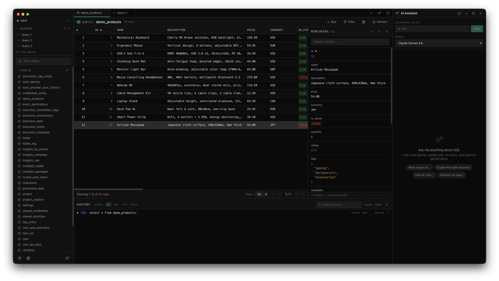

# SQL Client

A modern, native PostgreSQL client built with Electron, Svelte, and CodeMirror.




> **Note:** Currently tested with PostgreSQL only, on macOS. Other databases and platforms may work but are not officially supported yet.

## Features

- **Query Editor** — CodeMirror-powered SQL editor with PostgreSQL autocomplete, syntax highlighting, and formatting (Cmd+Shift+F)
- **Inline Editing** — Edit query results directly in the data grid. Supports all types including a dedicated JSON/JSONB modal editor
- **Connection Manager** — Save and organize multiple connections with color-coded indicators. Quick-switch with Cmd+K
- **Multi-Tab Interface** — Work on multiple queries and table previews simultaneously
- **Schema Browser** — Browse tables, columns, indexes, and foreign keys grouped by schema
- **AI Assistant** — Built-in Claude integration for explaining queries, fixing errors, and generating SQL from natural language
- **Query History** — Searchable execution history with filtering by type (manual, transaction, error)
- **Saved Queries** — File-backed .sql queries with auto-save, stored in a configurable directory
- **Undo Support** — Rollback INSERT, UPDATE, and DELETE operations directly from the app

## Tech Stack

- [Electron](https://www.electronjs.org/) — Cross-platform desktop app
- [Svelte 5](https://svelte.dev/) — Reactive UI components
- [CodeMirror 6](https://codemirror.net/) — Code editor with SQL and JSON language support
- [Tailwind CSS 4](https://tailwindcss.com/) — Styling
- [Postgres.js](https://github.com/porsager/postgres) — PostgreSQL driver
- [Anthropic SDK](https://github.com/anthropics/anthropic-sdk-typescript) — AI assistant integration

## Getting Started

### Prerequisites

- [Bun](https://bun.sh/) (or Node.js 20+)
- A running PostgreSQL instance

### Install

```bash
git clone https://github.com/lyubo-velikov/sql-client.git
cd sql-client
bun install
```

### Development

```bash
bun run dev
```

### Build

```bash
bun run build
```

## Keyboard Shortcuts

| Action | Mac | Windows / Linux |
|---|---|---|
| Execute query | Cmd+Enter | Ctrl+Enter |
| Format SQL | Cmd+Shift+F | Ctrl+Shift+F |
| Save changes | Cmd+S | Ctrl+S |
| Toggle history | Cmd+Shift+H | Ctrl+Shift+H |
| Toggle AI assistant | Cmd+Shift+A | Ctrl+Shift+A |
| Quick-switch connection | Cmd+K | Ctrl+K |
| New query tab | Cmd+N | Ctrl+N |
| Close tab | Cmd+W | Ctrl+W |
| Switch to tab 1-9 | Cmd+1-9 | Ctrl+1-9 |

## License

[MIT](LICENSE)
